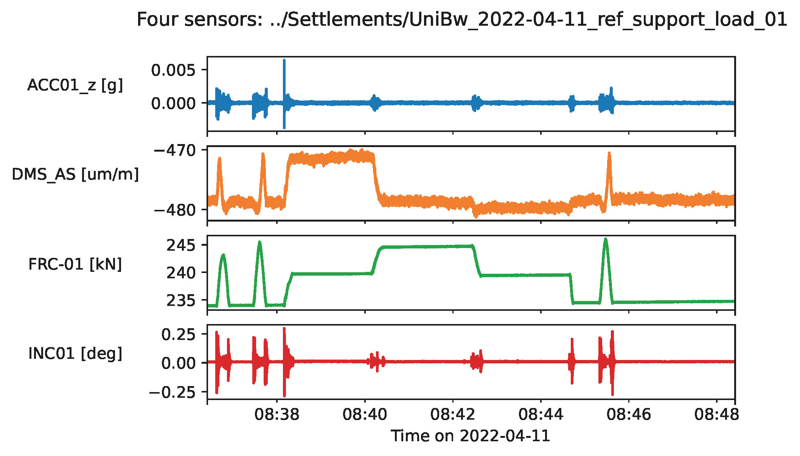

# munich-bridge-data
Visualisation and analysis routines for test bridge sensor data.

## Abstract
This repo collects MATLAB and Python routines to interact with the "raw" sensor data. It provides an entry point into sensor data analysis and convenient plotting functions. A small set of sample data is also contained including measurements from each sensor type (acceleration, strain, force, and inclination) for one load test on 2022-04-11 sampled at 100 Hz as shown below. The full data set (3TB) can be obtained upon reasonable personal request from the authors of the referenced [publication](#publication). 

## How to cite munich-bridge-data?

Whenever you use or mention munich-bridge-data in some sort of scientific document/publication/presentation, please cite the following publication.

Y. Jaelani, A. Klemm, J. Wimmer, F. Seitz, M. Köhncke, F. Marsili, A. Mendler, M. von Danwitz, S. Henke, M. Gündel, T. Braml, M. Spannaus, A. Popp, S. Keßler, Steel Construction 2023, 16, 215.
