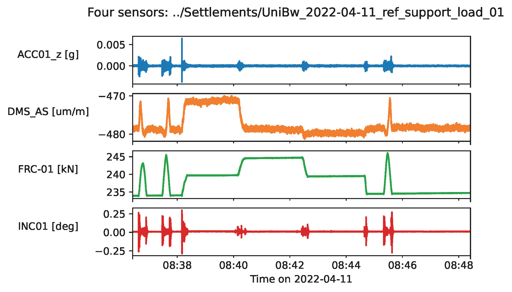

# munich-bridge-data
Visualisation and analysis routines for test bridge sensor data.

## Abstract
This repo collects MATLAB and Python routines to interact with the "raw" sensor data. It provides an entry point into sensor data analysis and convenient plotting functions. A small set of sample data is also contained including measurements from each sensor type (acceleration, strain, force, and inclination) for one load test on 2022-04-11 sampled at 100 Hz as shown below. The full data set (3TB) can be obtained upon reasonable personal request from the authors of the referenced [publication](#publication). 

## Folder Tree
Original folder with the whole dataset is stored in: `P:\Projects\PhySimTwin\01 Munich bridge data\Export`. The structure of the folder is as follows:

* `Test measurement` contains data related to:
  * ambient conditions, i.e., no applied loads and no damage scenarios nor loads;
  * load conditions, i.e., travelling vehicle(?);
  * shaker.
* `Neuer ordner` contains data related to ambient conditions (again?)
* `Damage scenarios` contains data related to the damaged structure. For each damage scenario, `Ambient data` and `Load tests` folders are present. Among the damage scenarios investigated, I am now interested in the settlements.
  * `Ambient data\Settlements` is pretty clear, though the files labeled as `03` is split in $27$ subfiles, each labelled as `UniBw_2022-04-11_support_03_ref_ambient_000i.csv` for $i$ in $[1\dots27]$. Why so?;
  * `Load tests\Settlements` contains a `Lowering` subfolder, whose scope is unclear, what is that for? Furthermore, inside this subfolder, the file for the $1 $cm settlement is split in two subfiles `01` and `02`, why? Finally, there appears to be another `_ref` file. WHat is that about?

Side note: a 1.8 GB file has ~1.8E+06 lines.

## How to cite munich-bridge-data?

Whenever you use or mention munich-bridge-data in some sort of scientific document/publication/presentation, please cite the following publication.

Y. Jaelani, A. Klemm, J. Wimmer, F. Seitz, M. Köhncke, F. Marsili, A. Mendler, M. von Danwitz, S. Henke, M. Gündel, T. Braml, M. Spannaus, A. Popp, S. Keßler, Steel Construction 2023, 16, 215.
